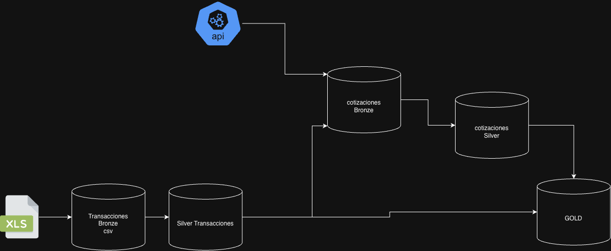
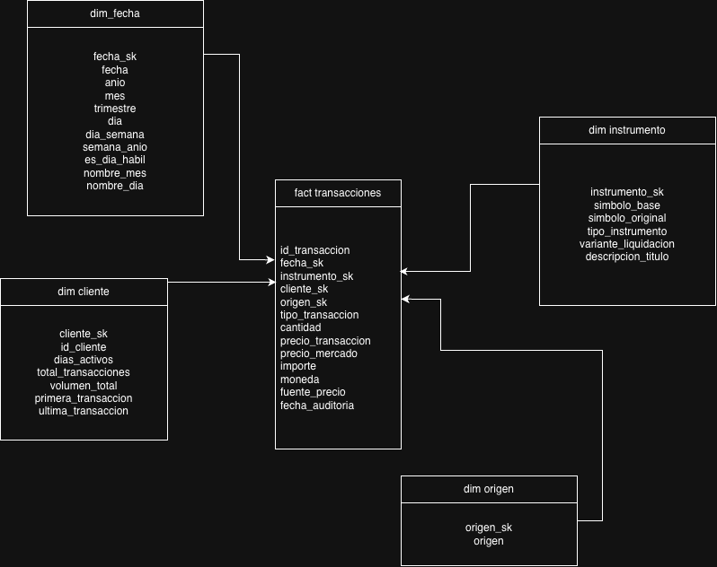

# IOL Challenge Pipeline - Arquitectura Medallion

Pipeline ETL de procesamiento de transacciones financieras y cotizaciones de mercado implementado con arquitectura Medallion (Bronze-Silver-Gold) en Databricks.

## Diagrama de Arquitectura



### Capas del Pipeline



## Instrucciones de Reproducción

### Es necesario para ejecutar el pipeline

* Workspace de Databricks con compute serverless habilitado
* Python 3.10+
* Conexión a Internet (para llamadas a Yahoo Finance API)

### Paso 1: Setup Inicial - Crear Tablas

Ejecutar el orquestador DDL para crear toda la estructura de tablas:


Navegar a: /ddl/DDL Orchestrator - Setup All Tables
Ejecutar todas las celdas del notebook 


Este notebook ejecuta en orden:

1. **create_schemas**: Crea los schemas bronze, silver, gold
2. **create_tables_audits**: Tablas de auditoría para tracking de ejecuciones
3. **create_table_bronze_\***: Tablas de la capa Bronze
4. **create_table_silver_\***: Tablas de la capa Silver
5. **create_table_gold_dim_\***: Dimensiones del modelo estrella
6. **create_table_gold_fact_transacciones**: Tabla de hechos

### Paso 2: Ejecutar orquestador.

## Extracción de datos:
en este pipe se hace la extraccion desde el csv en el excel filtrando por fecha, porque se hizo así para poder simular cargas diarias. 
otra opcion podría haber sido subir el dataset al volume.
Ademas sortee la idea de utilizar un copy into para leer el archivo completo y escuchar el directorio para poder hacer la carga incremental(no se decidio de esta forma porque no sabia el comportamiento del origen de los datos.)


##Enriquecer los Datos:
Esta tapa quedo un poco corta, por el motivo que no conseguí fuentes de datos para conseguir mas cotizaciones de diferentes instrumentos. (podría agregase una cotizacion del dolar en el momento de la transaccion para no perder información)
debido a tiempo y desconocimiento de negocio no pude completar esta parte con exito. 


##Calidad de datos:
Se genero test en la etapa silver para controlar los registros que no cumplan con reglas de negocios, estos registros se cargan en una tabla para monitoreo.(se deberia agregar una etapa de test de refined para monitorear comportamientos anomalos)

##Integracion con IA
Mi propuesta de integracion con IA es la calidad conjunto con la tabla de test.
El agente busca la tabla de los test fallidos y con los id de los registros fallidos busca patrones dentro de las tablas de trusted. Con esto se generaria un reporte 


* **Mecanismo Operativo:**
  1. Durante la ejecución del pipeline (capa Bronze/Silver), las pruebas de calidad insertan las operaciones rechazadas en `audit.test_failed_records` registrando el `record_id`, `test_id` y `failure_reason`[cite: 1].
  2. Un script en PySpark realiza un `JOIN` entre `audit.test_failed_records` y las tablas procesadas (`silver_transacciones`) utilizando el `record_id` para reconstruir el contexto completo de la transacción (canal, franja horaria, ticker, tipo de usuario).
  3. El contexto consolidado se envía en formato JSON a un LLM (Agente de IA) que analiza las correlaciones entre los atributos y genera un informe ejecutivo con acciones correctivas recomendadas.

---

### Prompt Estructurado para el Agente (System Prompt)

```python
ROL Y CONTEXTO:
Actúas como un Agente Senior de Observabilidad de Datos en InvertirOnline (IOL). Tu objetivo es analizar la tabla de auditoría de pruebas fallidas ("audit.test_failed_records") cruzada con el contexto de las transacciones originales ("silver_transacciones") para identificar patrones sistemáticos de falla.

DATOS ENTRANTES (JSON):
- Audit_Log: { "run_id": "RUN_20260216_01", "test_name": "CHK_PRECIO_RANGO", "total_failures": 1420 }
- Sample_Context: [
    {"record_id": "TXN_001", "failure_reason": "Precio fuera de rango devuelto (-10.5)", "origen": "App Mobile", "fecha": "2026-02-16 03:15:00 UTC", "ticker": "AL30D"},
    {"record_id": "TXN_002", "failure_reason": "Precio fuera de rango devuelto (0.0)", "origen": "App Mobile", "fecha": "2026-02-16 03:22:00 UTC", "ticker": "GD30D"},
    {"record_id": "TXN_003", "failure_reason": "Precio fuera de rango devuelto (-1.0)", "origen": "App Mobile", "fecha": "2026-02-16 03:40:00 UTC", "ticker": "AL30C"}
  ]

TAREA:
1. Analiza los datos de entrada e identifica las variables en común entre los registros fallidos (canal, horario, activos).
2. Determina la Causa Raíz (Root Cause) probable a nivel técnico o de negocio.
3. Asigna un nivel de severidad operacional (Crítico / Alto / Medio / Bajo) justificando el impacto en los reportes de la capa Gold.
4. Genera recomendaciones técnicas concretas para solucionar la falla en origen o dentro del pipeline ETL.

FORMATO DE SALIDA REQUERIDO:
### 🚨 Reporte de Observabilidad y Causa Raíz (RCA)
- **Patrón Detectado:** [Resumen de coincidencias halladas]
- **Diagnóstico de Causa Raíz:** [Explicación técnica del error]
- **Severidad Operacional:** [Nivel e impacto en capa Gold]
- **Acciones Correctivas Recomendadas:** [Pasos para resolver el problema]


